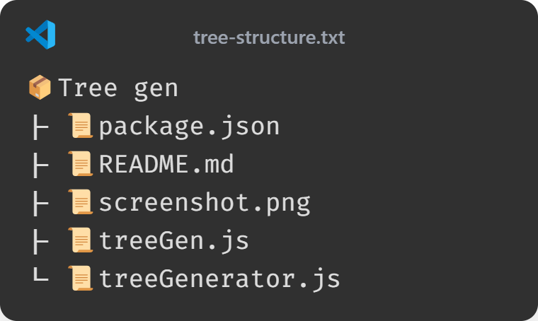

# tree-structure-gen

### This project uses NodeJS to create a tree structure of the directory you want to create the structure of

## Installation and Usage guide:

1. Clone the repo.
2. Make sure you have NodeJS installed on your machine.
3. Open the project and run the command:
   ```bash
   npm install -g
   ```
   This will make the bin command entries accessible globally according to your NodeJS setup
4. Run `tree-dir` or `tree-gen` to run those two scripts.
5. After running either of those two scripts, the output will be stored in a new txt file.

Screenshots:


